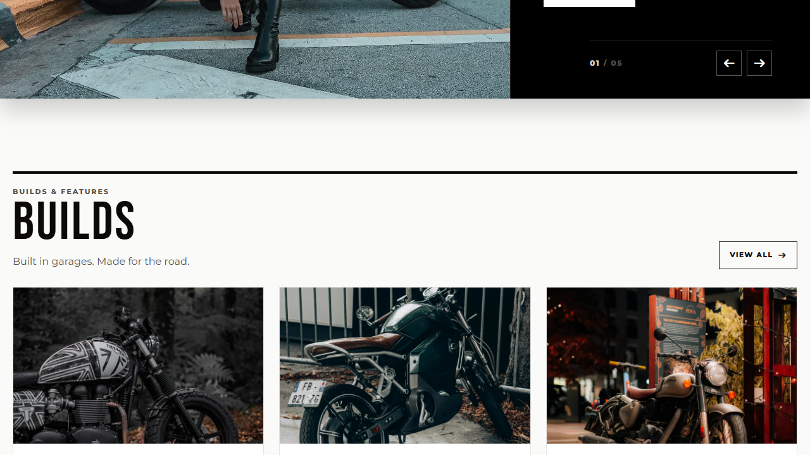
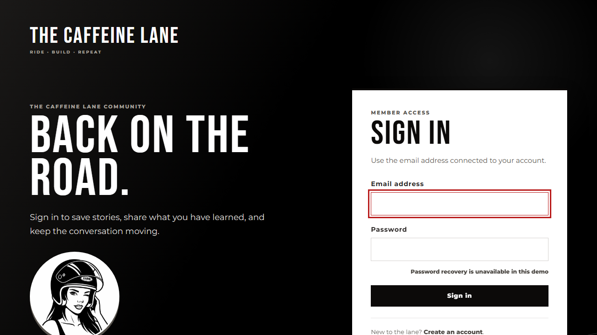

# Caffeine Lane

> A focused editorial web application for cafe racer builds, guides, and reviews.

Caffeine Lane provides a dedicated, structured space for motorcycle builders and enthusiasts to publish build logs, mechanical guides, and gear reviews. It combines a rich editorial catalog with email-based authentication, reader profiles, moderated single-level discussion threads, full-text search, and bilingual interface support. It is intentionally an editorial platform and community discussion space, not an e-commerce marketplace.

## Demo

- [Production web app](https://caffeinelane.onrender.com)
- [Service health](https://caffeinelane.onrender.com/healthz/)

## Screenshots

### Public discovery




### Reader participation




## Key capabilities

- Editorial publishing with draft/published lifecycle, scheduling, categories, and WebP media.
- Structural taxonomy based on fixed core categories (`builds`, `guides`, `reviews`).
- Reader participation with email-based accounts, profiles, and single-level comment threads.
- Content discovery through home hero carousel, category catalog, search, and related posts.
- Bilingual user interface with English as default and complete Spanish translations.

## Engineering highlights

- **Custom email-based identity.** Replaces Django default username auth with a custom `accounts.User` model using normalized email logins and Argon2id password hashing.
- **Single-level comment tree.** Restricts parent-child comment nesting to a maximum depth of one level at the ORM and form boundaries, preventing nested thread collapse.
- **Static and media asset separation.** WhiteNoise delivers hashed, pre-compressed static assets from the runtime, while Cloudinary provides durable object storage for uploads.
- **Dual database connection routing.** Routes web traffic through Neon serverless connection pooler while executing schema migrations over a direct connection for DDL locks.
- **Fresh database baseline guard.** Management command `check_fresh_baseline` inspects database schemas before migration rollout, preventing schema drift or incompatible tables.
- **Multi-layer automated quality gates.** Combines Pytest for backend domain logic, Node.js for frontend asset pipeline tests, Playwright for cross-browser smoke tests, and Docker for CI smoke validation.

## Architecture

```text
Browser -> HTTPS -> Render (Docker / Gunicorn) -> Django (core, accounts, posts)
                                              -> Neon PostgreSQL (Data)
                                              -> Cloudinary (Media)
                                              -> Resend / Anymail (Email)
                                              -> WhiteNoise (Static Assets)
```

The Django application owns URL routing, data validation, domain services, internationalization, and template rendering. See [Architecture](docs/ARCHITECTURE.md) for module boundaries and data flow.

## Technology stack

- **Backend:** Python 3.13, Django 6.0, Gunicorn, PostgreSQL 18, and Neon.
- **Frontend:** Tailwind CSS 4, Node.js 22, pnpm, and Django Templates.
- **Cloud & Delivery:** Docker, Render, Cloudinary, Resend (Anymail), and WhiteNoise.
- **Tooling & Quality:** uv, Pytest, Playwright, Ruff, and GitHub Actions.

## Repository structure

| Path              | Responsibility                                                                              |
| ----------------- | ------------------------------------------------------------------------------------------- |
| `apps/accounts`   | Custom user model, registration, authentication, profiles, and password flows.              |
| `apps/core`       | Public landing page, Home, About, Contact form, and health monitoring endpoints.            |
| `apps/posts`      | Editorial catalogue, category taxonomy, search, comments, and moderation.                   |
| `config/settings` | Split environment configurations (base, local, test, and production).                       |
| `docker/`         | Production Dockerfile and startup entrypoint orchestration.                                 |
| `static/`         | Authored frontend source (`static/src/`) and compiled distribution assets (`static/dist/`). |
| `templates/`      | Reusable semantic HTML layouts, domain partials, and page templates.                        |
| `tests/`          | Frontend asset pipeline tests (`tests/frontend/`) and Playwright E2E tests (`tests/e2e/`).  |

## Local development

Prerequisites: Python 3.13+, uv, Node.js 22, pnpm 10, and Docker Compose.

```powershell
Copy-Item .env.example .env
docker compose up -d db
uv sync --locked
pnpm install --frozen-lockfile
pnpm run build
uv run python manage.py check_fresh_baseline
uv run python manage.py migrate
uv run python manage.py seed_portfolio
```

On macOS or Linux, replace `Copy-Item` with `cp`.

Start the frontend asset watcher in one terminal:

```bash
pnpm run dev
```

Start the Django development server in another terminal:

```bash
uv run python manage.py runserver
```

Open `http://localhost:8000`.

## Quality

```bash
uv run ruff check .
uv run ruff format --check .
uv run python manage.py check
uv run pytest
pnpm run build
pnpm test
pnpm run test:e2e
```

CI runs formatting checks, Django migrations validation, Pytest suites across Python 3.13 and 3.14 against PostgreSQL 18, production deployment setting checks, Playwright browser smoke tests, and containerized Docker build smoke tests. See [Testing](docs/TESTING.md) for full test strategy.

## Documentation

- [Project](docs/PROJECT.md) — product scope, target actors, and durable domain rules.
- [Architecture](docs/ARCHITECTURE.md) — system structure, component boundaries, and cloud integrations.
- [Development](docs/DEVELOPMENT.md) — local environment, database lifecycle, and command matrix.
- [Testing](docs/TESTING.md) — test layers, data isolation, and release verification gates.
- [Deployment](docs/DEPLOYMENT.md) — multi-stage Docker delivery, database migrations, and validation.

## Context

Caffeine Lane started as a final project for the [Informatorio](https://informatorio.chaco.gob.ar/) program in Resistencia, Chaco, and was later rebuilt and modernized as a personal application. It is maintained as an independent editorial platform to demonstrate modern Python/Django patterns, structured testing, and multi-provider cloud delivery.
