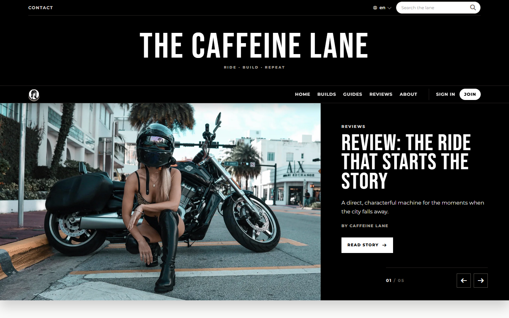
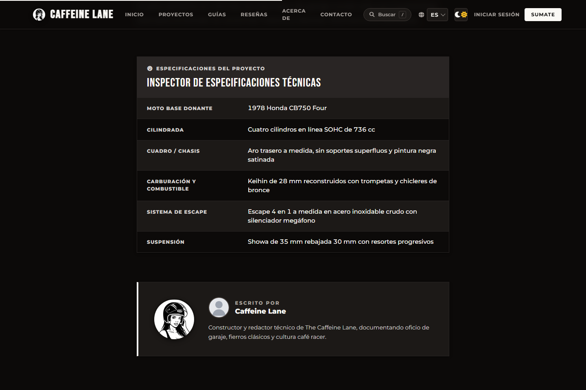
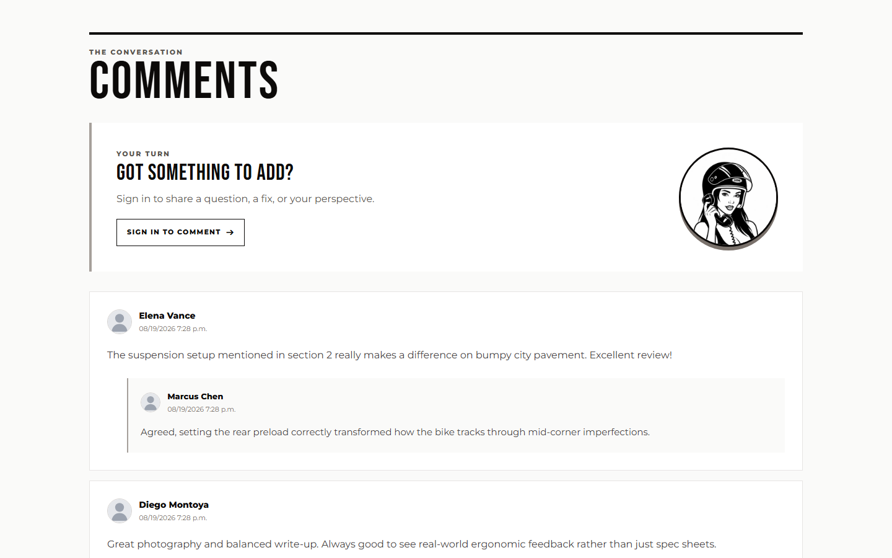
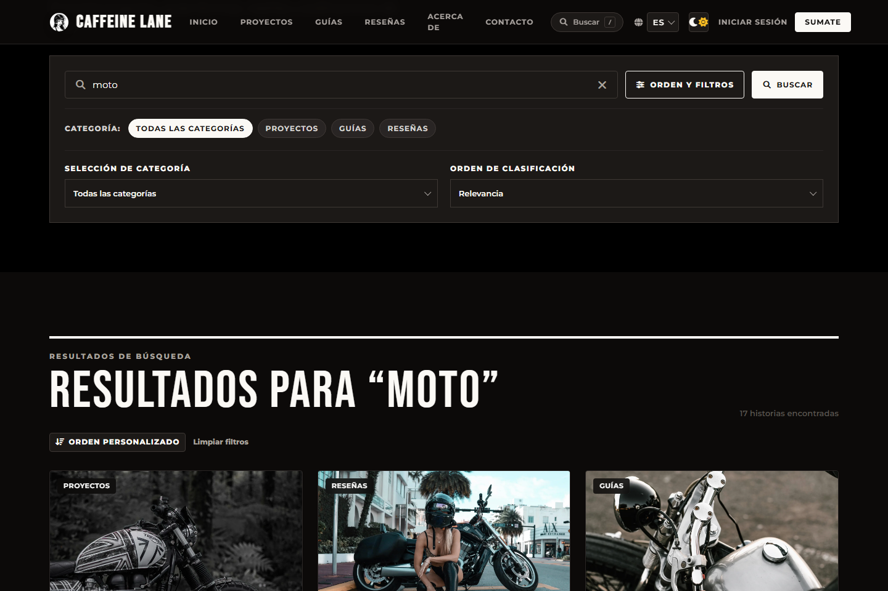
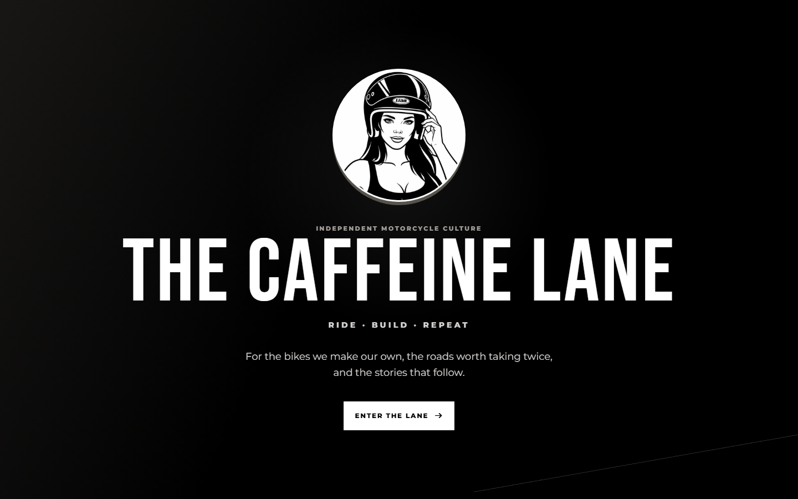

# Caffeine Lane

[](https://github.com/acevedo-daniel/caffeine-lane/actions/workflows/ci.yml)

> An independent editorial journal for cafe racer builds, workshop guides, reviews, and rider culture.

Caffeine Lane is crafted for builders and riders who appreciate greasy knuckles, clean lines, and thoughtful engineering. Instead of another noisy social feed, it is a deliberate, server-rendered publishing platform: long-form build logs with technical specs, practical garage guides, honest reviews, focused reader discussions, and a bilingual interface in Spanish and English.

**[Explore the Live Journal — caffeine-lane.vercel.app](https://caffeine-lane.vercel.app/)** · **[Deployment Guide](docs/DEPLOYMENT.md)**

## Live demo

The public instance is live and running at [caffeine-lane.vercel.app](https://caffeine-lane.vercel.app/).

> [!NOTE]
> The live demo keeps password recovery disabled by default. Until a custom domain is verified in Resend, outbound transactional emails are restricted to sandbox recipients.

## Screenshots

### Editorial home



### Experience & community

| Article detail & build specs | Community discussion |
| --- | --- |
|  |  |

| Search & category filters | Public landing experience |
| --- | --- |
|  |  |

## What's inside

- **Curated publishing:** In-depth build breakdowns, garage tutorials, and gear reviews organized around three structural categories (`builds`, `guides`, `reviews`), complete with verified image uploads and motorcycle spec sheets.
- **Search that works:** Weighted PostgreSQL full-text search with relevance ranking, instant input clearing, and category filters that survive pagination.
- **Reader community:** Clean email authentication, personal rider profiles with custom avatars, and one-level deep discussion threads designed for meaningful dialogue rather than endless comment trees.
- **Bilingual by design:** Seamless switching between Spanish and English powered by Django's native gettext runtime.
- **Thoughtful reading experience:** Reading progress indicator, dark mode with system preference detection, and zero heavy client-side framework bloat.

## Engineering decisions

- **Server-rendered with intent.** Rather than bolting on a complex single-page app framework, Caffeine Lane leans into classic Django templates, modern Tailwind CSS, and surgical vanilla JavaScript. Pages render instantly from the server and feel snappy on mobile screens.
- **Email-first identity.** The custom `accounts.User` model makes email the primary identifier from day one, backed by Argon2 password hashing in production, completely bypassing Django's historical username baggage.
- **PostgreSQL search with a graceful fallback.** Production queries leverage PostgreSQL's native `SearchVector` and `SearchRank` with tuned weights across titles, excerpts, and content, while keeping a clean SQLite `icontains` fallback so offline local development stays friction-free.
- **Disciplined discussion boundaries.** Comments are validated through an explicit service layer before touching the database. Replies are strictly capped at one level to keep threads readable, with clear states for withdrawn comments and moderator actions.
- **Dual-connection database topology.** Web requests run through Neon's connection pooler for serverless efficiency, while schema migrations execute strictly out-of-band over an unpooled direct connection to avoid transaction pooling lockups.

## Architecture

```text
Browser -> Vercel CDN / Django function (Python 3.14)
                  -> Neon PostgreSQL (pooled runtime / direct migrations)
                  -> Cloudinary (user & editorial media)
                  -> Resend (transactional email)
```

Django acts as the cohesive core: routing, authentication, form validation, business rules, and template rendering all live together. Static assets compile to minified CSS and clean ES modules, served directly from Vercel's global edge network.

## Technology stack

- **Backend:** Python 3.14, Django 6, PostgreSQL, and Gunicorn.
- **Frontend:** Django Templates, Tailwind CSS 4, and vanilla JavaScript.
- **Services:** Neon, Cloudinary, Resend via Anymail, WhiteNoise, and Vercel.
- **Tooling:** uv, pnpm, Pytest, Playwright, Ruff, Docker, and GitHub Actions.

## Repository structure

| Path | Responsibility |
| --- | --- |
| `apps/accounts` | Custom user model, authentication, registration, profiles, and password flows. |
| `apps/core` | Landing/home surfaces, contact flow, image validation, and health endpoints. |
| `apps/posts` | Editorial content, taxonomy, search, comments, moderation, and publishing behavior. |
| `config/settings` | Base, local, test, and production Django settings. |
| `docker/` | Production container startup and migration orchestration. |
| `static/` | Authored frontend source and compiled distribution assets. |
| `templates/` | Shared server-rendered layouts and page templates. |
| `tests/` | Frontend asset tests and Playwright browser tests. |

## Quickstart

Prerequisites: Python 3.14+, uv, Node.js 22, pnpm 10, and Docker Compose.

```bash
# 1. Setup environment and database container
cp .env.example .env
docker compose up -d db

# 2. Install dependencies and compile assets
uv sync --locked
pnpm install --frozen-lockfile
pnpm run build

# 3. Verify baseline, run migrations, and seed editorial content
uv run python manage.py check_fresh_baseline
uv run python manage.py migrate
uv run python manage.py seed_editorial
```

> On Windows PowerShell, use `Copy-Item .env.example .env`.

Start the frontend asset watcher in one terminal:

```bash
pnpm run dev
```

Run Django in another terminal:

```bash
uv run python manage.py runserver
```

Open [`http://localhost:8000`](http://localhost:8000) to browse the journal locally.

## Quality & tests

The codebase is backed by a multi-tier test suite:

```bash
# Linting, formatting, and Django system checks
uv run ruff check .
uv run ruff format --check .
uv run python manage.py check
uv run python manage.py makemigrations --check --dry-run

# Backend test suite with coverage (108 tests)
uv run pytest

# Frontend asset and module unit tests (23 tests)
pnpm test

# Full browser smoke tests with Playwright (9 tests)
pnpm run test:e2e
```

CI runs the Python suite against PostgreSQL 18 on Python 3.14, validates production settings, builds and tests frontend assets, runs Playwright browser smoke tests, and verifies the production Docker container.

## Documentation

- [Project & Domain](docs/PROJECT.md) — Scope, user personas, editorial rules, and provenance.
- [Architecture](docs/ARCHITECTURE.md) — System topology, component boundaries, invariants, and trade-offs.
- [Development Workflow](docs/DEVELOPMENT.md) — Local environment, database commands, and asset pipeline.
- [Testing Strategy](docs/TESTING.md) — Testing strategy, test layers, and quality gates.
- [Deployment Guide](docs/DEPLOYMENT.md) — Hosting topology, Vercel runtime contract, and release pipeline.
