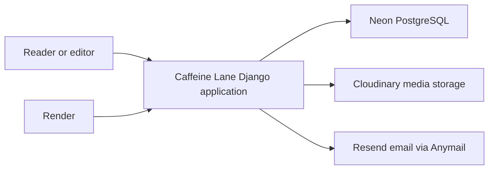

# Architecture

## Summary

Caffeine Lane is a server-rendered Django application. Django owns routing, authentication, forms, data access, templates, internationalization, and the admin interface. Tailwind CSS and small external JavaScript modules provide frontend behavior; Django serves generated assets locally and WhiteNoise serves them in production.

## System context

## Main components

| Component | Responsibility | Technology |
|---|---|---|
| `apps.core` | Landing, Home, About, Contact, CSP reports, and health endpoints | Django views and templates |
| `apps.accounts` | Custom email-based user model, registration, login, profiles, password flows, and feature flags | Django auth |
| `apps.posts` | Categories, posts, search, comments, moderation, and editorial management commands | Django ORM and forms |
| `config.settings` | Environment-specific configuration for local, test, and production | Django settings and django-environ |
| `templates/` | Shared layouts, components, and page templates | Django templates |
| `static/src/` | Authored Tailwind CSS and JavaScript modules | Tailwind CSS and JavaScript |
| `static/dist/` | Generated frontend output consumed by Django and Docker | Generated assets |
| `docker/entrypoint.sh` | Production startup sequence | POSIX shell |

The request path is URL configuration to a Django view, then a queryset and/or form, then a page template built from shared layouts and components. The browser receives generated CSS and JavaScript from `static/dist`; the source tree is not a runtime asset directory.

## Data

- **Source of truth:** Django models backed by PostgreSQL in normal local and production operation.
- **Persistence:** `accounts.User` stores account and profile fields. `posts.Category` and `posts.Post` store the editorial catalogue; posts can have multiple categories. `posts.Comment` belongs to a post and may reference one parent comment for a single reply level.
- **Important rules:** Public querysets include published posts only. Structural categories are `builds`, `guides`, and `reviews`. Post slugs `search` and `new` are reserved. Visible images require alternative text.

SQLite is an intentional local fallback when `DATABASE_URL` is absent. Tests use in-memory storage and an in-memory SQLite database unless `TEST_DATABASE_URL` is supplied.

## Security boundaries

- **Authentication:** Django authentication uses the custom `accounts.User` model with email as the login identifier.
- **Authorization:** Django permissions gate editorial actions; comment authors can manage their own comments and moderators require `posts.moderate_comment`.
- **Secrets and sensitive data:** `.env` and provider credentials are unversioned. Production settings require a production `SECRET_KEY`, database URL, Cloudinary credential, Resend key, and contact recipient. Passwords are never seeded.
- **Production transport:** Render's HTTPS proxy can be trusted through `USE_X_FORWARDED_PROTO`; secure redirects, secure cookies, HSTS, and CSP are configured in production settings.

## External dependencies

| Dependency | Reason | Impact if it fails |
|---|---|---|
| Neon | Hosted PostgreSQL for application data | The application cannot read or write persistent data. |
| Cloudinary | Production media storage for uploaded images | New media uploads fail; existing media delivery depends on the provider. |
| Resend | Transactional email through Anymail | Contact delivery and enabled reset email cannot be delivered; contact returns controlled feedback. |
| Render | Docker hosting and health monitoring | The public service is unavailable until a healthy deployment is restored. |
| WhiteNoise | Production static-file delivery | Static presentation assets are unavailable or incomplete if collection/build fails. |

## Known limitations

- Public password reset is disabled by default while the Resend onboarding sender cannot deliver to arbitrary visitors.
- `seed_portfolio` is idempotent but updates its defined sample posts when run; it is an explicit content-bootstrap tool, not a recurring editorial sync.
- A database that contains `accounts_profile` cannot be used with the current account schema and must be replaced with a fresh database.
