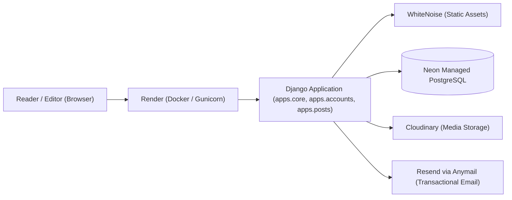

# Architecture

## Summary

Caffeine Lane is a monolithic, server-rendered Django application. Django owns URL routing, authentication, request validation, database persistence, internationalization, template rendering, and administrative interfaces. A lightweight Node.js/pnpm frontend pipeline builds Tailwind CSS 4 and modular JavaScript assets into deterministic runtime bundles served locally by Django and in production by WhiteNoise.

## System Topology



## Application Boundaries

| Django App / Directory | Responsibility                                                                                                                     | Must Not Own                                           |
| ---------------------- | ---------------------------------------------------------------------------------------------------------------------------------- | ------------------------------------------------------ |
| `apps.core`            | Public landing page, Home, About, Contact form, CSP violation reports, and `/healthz/` liveness endpoint.                          | Post editorial logic, user auth, comment lifecycle.    |
| `apps.accounts`        | Custom email-based user model (`accounts.User`), authentication, registration flows, profile editing, and password reset handling. | Editorial publishing, category taxonomy, public views. |
| `apps.posts`           | Categories, editorial posts, taxonomy invariants, full-text search, comment tree, and administrative moderation.                   | User authentication mechanics, core static routing.    |
| `config.settings`      | Environment-specific configurations (`base.py`, `local.py`, `production.py`, `test.py`).                                           | Application business logic or direct view rendering.   |
| `templates/`           | Reusable semantic HTML layouts, domain partials, form components, and internationalized page templates.                            | Direct database queries or Python business logic.      |
| `static/src/`          | Authored frontend source (Tailwind CSS 4, modular JavaScript controllers).                                                         | Hand-edited build artifacts.                           |
| `static/dist/`         | Deterministic compiled CSS and JavaScript assets generated by the asset pipeline.                                                  | Manual edits (output is completely generated).         |
| `docker/`              | Container entrypoint script (`entrypoint.sh`) managing database readiness, migrations, static collection, and Gunicorn startup.    | Local-only development commands.                       |

## Request Lifecycle

The application adheres to a clean, unidirectional request flow:

```text
HTTP Request -> Security Middleware -> URL Dispatcher -> View / Form -> ORM Queryset / Service -> Template Render -> HTTP Response
```

1. **Security & Transport Middleware:** Enforces HTTPS redirects, trusted proxy headers (`X-Forwarded-Proto`), CSRF protection, and Content Security Policy (CSP).
2. **Views & Forms:** Handle incoming GET/POST parameters, validate form input with clean validation methods, and manage user session state.
3. **Domain Services & ORM:** Querysets enforce business rules (e.g. `is_published=True` for public queries, single-level parent constraints for comments).
4. **Templates & Context Processors:** Render semantic HTML with active language context and injected navigation/category processors.

## Data Models & Persistence

- **Primary Source of Truth:** PostgreSQL 18 (managed by Neon in production; Docker Compose locally).
- **`accounts.User`:** Custom user model using `email` as the unique authentication identifier, paired with Argon2id password hashing.
- **`posts.Category`:** Structural taxonomy (`builds`, `guides`, `reviews`) and supplementary topics with URL slug indexing.
- **`posts.Post`:** Editorial articles with Many-to-Many category relationships, publication date sequencing, draft/published status, and featured image metadata (`alt_text`).
- **`posts.Comment`:** Flat-and-nested discussion model with a self-referential `parent` foreign key constrained to a maximum depth of 1 level.

SQLite is preserved solely as an in-memory test database and an isolated offline local fallback when `DATABASE_URL` is omitted.

## External Provider Integrations

| Provider             | Purpose                                                                                | Runtime & Failure Behavior                                                                                      |
| -------------------- | -------------------------------------------------------------------------------------- | --------------------------------------------------------------------------------------------------------------- |
| **Neon**             | Serverless PostgreSQL database with pooled and direct connections.                     | Primary data persistence. Application fails gracefully if database is unreachable.                              |
| **Cloudinary**       | Cloud object storage for uploaded editorial covers and user avatars.                   | Uploads stream directly to Cloudinary via `django-cloudinary-storage`. Fallback media delivery handled via CDN. |
| **Resend (Anymail)** | Transactional email delivery for contact inquiries and password recovery.              | Wrapped in exception handlers; delivery failures provide user-friendly feedback without breaking web requests.  |
| **WhiteNoise**       | High-performance static asset delivery with gzip/brotli compression and cache busting. | Bundled directly into the Django WSGI application for zero-dependency static serving.                           |
| **Render**           | Containerized web service hosting with health monitoring.                              | Listens on assigned `$PORT`, validates `/healthz/`, and restarts on unhandled fatal failures.                   |

## Security Architecture

- **Authentication:** Strict email-based login without exposed public usernames. Session authentication backed by signed, HttpOnly, SameSite cookies.
- **Password Hashing:** Passwords hashed with `Argon2id` via `argon2-cffi`.
- **Content Security Policy (CSP):** Restrictive CSP rules controlling scripts, styles, image sources (Cloudinary, self), and framing.
- **Transport Security:** HSTS headers, secure cookie flags (`SESSION_COOKIE_SECURE`, `CSRF_COOKIE_SECURE`), and proxy SSL header trust.
- **Rate Limiting:** IP-based sliding window rate limits on the public contact form to prevent spam.

## Invariants and Trade-offs

- **Server-Side Rendering (SSR):** Django templates provide zero-bundle fast page loads, SEO optimization, and progressive enhancement instead of a heavy SPA client.
- **Pooled vs Direct Database Connections:** Neon connection pooling (`DATABASE_URL`) is utilized for web requests, while migrations use direct connections (`DIRECT_DATABASE_URL`) to support schema locks.
- **Single-Level Comment Depth:** Multi-level recursive comment trees were intentionally rejected in favor of single-level replies to prevent UI clutter and deep nesting overhead.

## Related Documentation

- [Project](PROJECT.md)
- [Development](DEVELOPMENT.md)
- [Testing](TESTING.md)
- [Deployment](DEPLOYMENT.md)
