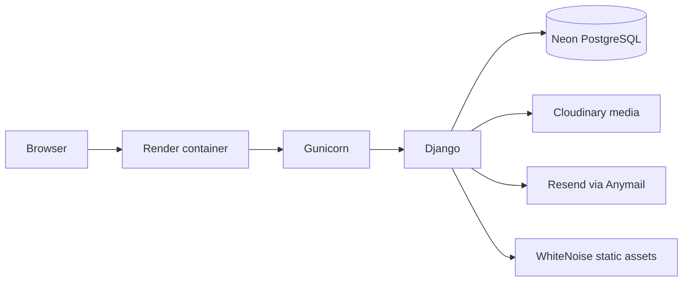

# Caffeine Lane — Architecture

> System structure, Django application boundaries, persistence, external integrations, and technical trade-offs.

## Summary

Caffeine Lane is a server-rendered Django monolith.

Django owns routing, authentication, forms and validation, persistence, editorial and discussion behavior, internationalization, template rendering, and the administrative interface. A small Node.js/pnpm pipeline builds Tailwind CSS and JavaScript assets before they are served by Django/WhiteNoise.

Production runs the application as a Dockerized Gunicorn service on Render.



## Application boundaries

| Area | Owns | Boundary |
| --- | --- | --- |
| `apps/core` | Landing/home surfaces, contact flow, image validation, CSP reporting, health endpoints | Does not own accounts or editorial domain models |
| `apps/accounts` | Custom user model, authentication, registration, profiles, password flows | Does not own post/comment behavior |
| `apps/posts` | Categories, posts, publishing behavior, search, comments, and moderation | Uses Django's user/permission boundary rather than owning authentication |
| `config/settings` | Base, local, test, and production configuration | Does not own application business behavior |
| `templates/` | Server-rendered layouts, forms, partials, and page templates | Does not own persistence/business logic |
| `static/src/` | Authored Tailwind and JavaScript source | Generated output belongs in `static/dist/` |
| `static/dist/` | Compiled frontend assets | Must not be edited manually |
| `docker/` | Container startup/migration/static-collection orchestration | Does not define local developer workflow |

## Request flow

A typical server-rendered request follows Django's normal request lifecycle:

```text
HTTP request
-> middleware
-> URL dispatcher
-> view / form
-> queryset or domain service
-> template render / redirect
-> HTTP response
```

Responsibilities are deliberately modest:

- **Views and forms** handle request input, permissions, form validation, messages, redirects, and rendering.
- **Models/querysets** define persistence shape and reusable query semantics such as published-content filtering.
- **Small services** hold lifecycle behavior where a named operation is clearer than embedding it directly in a view, such as publishing posts or moderating comments.
- **Templates/context processors** render the localized server-side interface.

The project does not impose a repository layer or a larger service architecture where Django's ORM and application boundaries are already sufficient.

## Data and persistence

Production application data is stored in PostgreSQL on Neon. Local development normally uses PostgreSQL 18 through Docker Compose, with SQLite available as an intentional local fallback when `DATABASE_URL` is omitted.

Tests use a separate configuration: SQLite in memory by default, or the explicit `TEST_DATABASE_URL` supplied by CI.

Important models:

- **`accounts.User`** — custom user model with unique email authentication.
- **`posts.Category`** — editorial taxonomy.
- **`posts.Post`** — draft/published editorial article with categories and media metadata.
- **`posts.Comment`** — discussion record with explicit visibility and optional one-level parent relation.

Django migrations are the schema source of truth.

## Search

Search behavior adapts to the active database backend.

On PostgreSQL, published content uses weighted full-text search:

```text
title   -> weight A
excerpt -> weight B
content -> weight C
```

`SearchVector`, `SearchQuery`, and `SearchRank` provide relevance ordering.

When another database backend is active, search falls back to case-insensitive matching across title, excerpt, and content. This keeps local/offline fallback usable without pretending to reproduce PostgreSQL ranking behavior.

## External integrations

| Integration | Responsibility | Application boundary |
| --- | --- | --- |
| Neon | Production PostgreSQL persistence | Only Django connects to the database |
| Cloudinary | Persistent uploaded media in production | Configured through Django storage |
| Resend through Anymail | Production email delivery | Accessed through Django's email backend |
| WhiteNoise | Collected static-file delivery | Runs inside the Django WSGI application |
| Render | Hosts the production Docker/Gunicorn service | Deployment/runtime concern |

The local/test configurations replace external services where appropriate: local media uses the filesystem, local email uses the console backend, and tests use in-memory email/media storage.

## Security boundaries

Caffeine Lane relies on Django's session authentication and permission system.

Production configuration adds:

- secure session and CSRF cookies;
- HTTPS redirect behavior;
- configurable HSTS;
- a Content Security Policy that can run in report-only or enforced mode;
- restricted production hosts and trusted CSRF origins;
- Argon2 as the first production password hasher;
- provider credentials loaded from environment variables rather than source control.

Authorization for editorial and moderation actions is enforced through authentication checks and Django permissions.

## Static and media assets

Authored frontend assets live under `static/src/`.

The pnpm build pipeline:

```text
static/src
-> Tailwind / JavaScript build
-> static/dist
-> collectstatic
-> WhiteNoise in production
```

Uploaded media follows a different path:

```text
local development -> filesystem
tests             -> in-memory storage
production        -> Cloudinary
```

Keeping static build artifacts and user-uploaded media separate avoids depending on the ephemeral application container for persistent uploads.

## Hosted topology

```text
Browser
  -> Render / Gunicorn / Django
      -> Neon PostgreSQL
      -> Cloudinary
      -> Resend
      -> WhiteNoise-collected static assets
```

The repository contains the production `Dockerfile` and entrypoint. Provider-specific secrets and service settings are configured outside Git.

## Invariants

- **Published-content boundary:** public editorial queries do not expose drafts.
- **Identity boundary:** email remains unique and is the authentication identifier.
- **Comment-depth boundary:** replies do not become recursive trees.
- **Permission boundary:** moderation/editing behavior is checked server-side.
- **Media boundary:** production uploads do not depend on container-local persistence.
- **Migration boundary:** production migrations can use a direct database connection separately from pooled web traffic.

## Trade-offs

### Server-rendered Django

Django templates keep routing, forms, authentication, localization, and rendering in one application boundary. The project gains a simpler deployment and avoids maintaining a separate frontend API contract, at the cost of tighter coupling between presentation and the Django application.

### PostgreSQL search with a fallback

PostgreSQL provides the intended ranked search behavior. The SQLite fallback keeps local/test scenarios usable, but its `icontains` behavior is intentionally less capable.

### Pooled runtime and direct migrations

Production runtime can use Neon's pooled connection while startup migrations temporarily switch to `DIRECT_DATABASE_URL`. This keeps normal web traffic compatible with pooling while giving schema operations a direct connection.

### Single-level discussions

One-level replies provide conversational context without requiring recursive rendering, deep thread navigation, or more complex moderation rules.

## Related documentation

- [README](../README.md)
- [Project](PROJECT.md)
- [Development](DEVELOPMENT.md)
- [Testing](TESTING.md)
- [Deployment](DEPLOYMENT.md)
